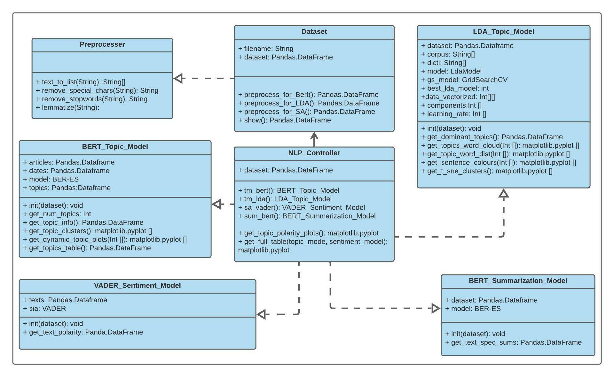

# **NLP4News Python Toolkit**
NLP4News is a lightweight python toolkit for managing and analyzing large datasets of news articles in order to identify topics, analyze sentiment and summarize. A full demo of the toolkit can be seen in the NLP4News_tutorial.ipynb file. 

## **Installation and Setup**

I recommend to use this toolkit in combination with a google colab notebook as it contains the majority of the libraries used by default. In this usecase the two remaining libraries to install are the two BERT based pretrained models: BERTopic, and the BERT_Extractive_Summarizer using the following commands:

```
> pip install bertopic
> pip install bert-extractive-summarizer
```
In addition to these two modules the NLP4News.py and utils.py should also be uploaded to the same folder as the colab notebook.

---

## **Customizing Data Retrieval**
By default this toolkit reads 1 csv file named 'Articles.csv' in the ```MyDataset``` class constructor and stores it in its ```dataset``` attribute. The dataset attribute is a ```Pandas Dataframe``` with the headings 'Article', 'Date', and 'Heading' so any changes to the constructor must follow these maning conventions.

---

## **Features**
The main features of this toolkit are found in the ```NLP_Controller``` class which can create 4 different NLP models of the data set using the following functions and can aggregate information from different models.

| Function | Parameters | Description |
| ----------- | ----------- | ----------- |
| tm_bert() | none | Returns a BERT_Topic_Model object |
| tm_lda() | none | Returns a LDA_Topic_Model |
| sa_vader() | none | Returns a VADER_Sentiment_Model |
| sum_bert() | none | Returns a BERT_Summarization_Model |
| get_topic_polarity_plots() | self, topic_num, topic_model, polarity_model | Plots the polarity of articles classified as the topic_num over time |
| get_full_table() | topic_model, polarity_model | adds columns to the original dataset with the sentiment and top 5 topics in eachh article |  

Furthermore each model has a series of functions to visualize and retrieve statistics from it which are described in the following table:

### **1. LDA_Topic_Model**
| Function | Parameters | Description |
| ------- | -------- | ------ |
| get_dominant_topics | none | Containing the dominant topic number for each doument along with how mcuh the topic appeared in the article |
| get_topic_word_cloud | topic_id | plots the words in the topic_id specified where the size is associated witht the importance of the word in the topic and saves the image |
| get_topic_word_dist | topic_id | Gets the distribution of article lengths for the specified topic id |
| get_sentence_colors | none | visualizes each sentence by coloring its words according to topic and drawing a box around the word according to the entire documents topic and saves the image|
| get_sne_cluster | none | project the topics distribution into 2d |

### **2. BERT_Topic_Model**
| Function | Parameters | Description |
| ------- | -------- | ------ |
| get_num_topics | none | returns the number of topics identified by bert |
| get_topic_desc | none | returns a dataframe of each topics vocabulary. note that Topic -1 is for outliers |
| show_topic_clusters | none | Visualizes the topics of each document in 2d and plots them |
| show_dynamic_topic_plots | num_topics | Visualizes the number of articles from the top x topics over time where x is the num_topics |
| get_topic_table | none | Creates a dataframe where each column represents the first through fifth most prominent topic ids in an article and each row represents an article |

### **3. VADER_sentimen_analyzer**
| Function | Parameters | Description |
| ------- | -------- | ------ |
| get_text_polarity() | none | returns the a dataframe of each topic and its commpound sentiment score |

### **4. BERT_Summarization_Model**
| Function | Parameters | Description |
| ------- | -------- | ------ |
| get_spec_text_sum() | text_id, n_sentences | returns the article associated with the specified text_id that has been summarized into n_sentences  |

---

## **Toolkit Design**
The design of the toolkit can be seen in the following class diagram:



The ```Preprocessor``` class contains a series of functions for several common NLP preprocessing techniques and which are used by the ```MyDataset``` class in order to manage the texts that are used to create each model. The ```NLP_Controller``` object contains a dataset object which it uses to preprocess the dataset appropriately for each model it creates using its methods. Each model's method returns the appropriate model object so that the analysis methods described above for each object can be used.

